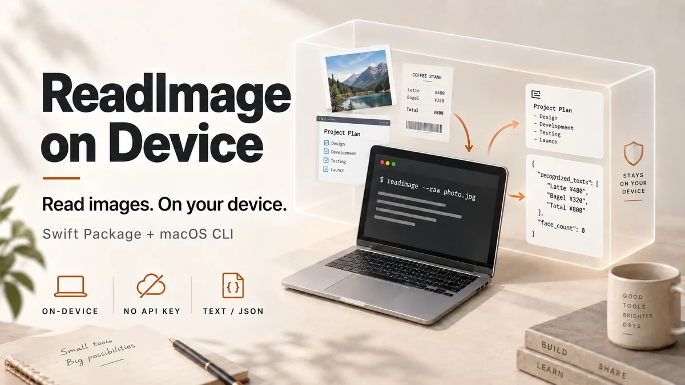
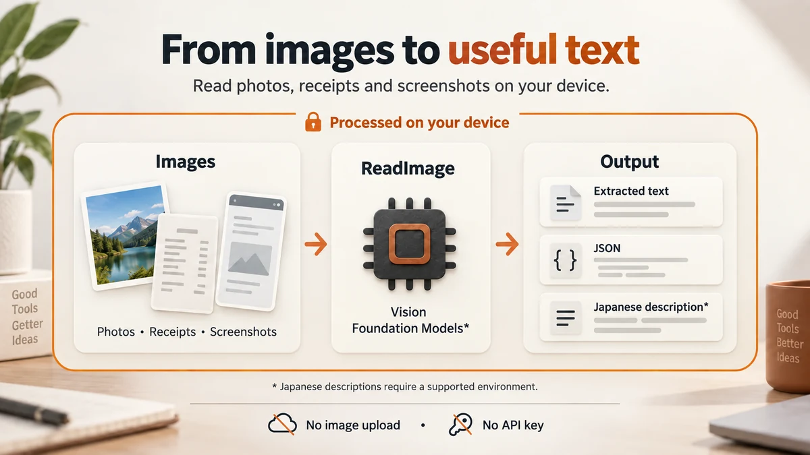

# ReadImage on Device

**English** · [简体中文](README.zh-CN.md) · [日本語](README.ja.md)



**Read images. On your device.**

A Swift package for extracting text and visual features from photos, documents and screenshots. It also includes `readimage`, a macOS CLI. Image analysis runs on your device using Apple's Vision and Foundation Models frameworks. No image uploads, API keys or external servers are required.

- **Extract text and visual features** — OCR, image classification, face/person/animal detection and barcode reading.
- **Get text or JSON** — for local storage, search, scripts and AI-agent preprocessing.
- **Generate Japanese descriptions on supported devices** — when Apple Intelligence is unavailable, the tool returns Vision's extracted information instead.

The library declares support for **macOS 11+ / iOS 13+**. The CLI is for macOS. The actual minimum OS also depends on your build toolchain ([compatibility](#compatibility-and-processing-routes)).

This README is in English. **CLI messages and descriptions are Japanese by default.** Translating the documentation does not change the tool's output language.

[Quick start](#quick-start-macos-cli) · [Choose an output](#choose-an-output) · [Use in Swift](#use-in-a-swift-app) · [Connect to an LLM](#connect-to-text-only-llms-and-agents)

## Quick start: macOS CLI

You need Git and a Swift 6.0+ toolchain. Build with Apple's developer tools (Xcode or Command Line Tools).

```bash
git clone https://github.com/hibachi-inc/ReadImage-on-Device.git
cd ReadImage-on-Device
swift build -c release

# Replace this path with your own image
.build/release/readimage --raw /path/to/image.png
```

`--raw` does not require Apple Intelligence, so it is a good first check. To use `readimage` in the examples below, set this alias after building (for the current shell only):

```bash
alias readimage="$PWD/.build/release/readimage"
```

```bash
readimage --raw receipt.jpg         # Vision's extracted information
readimage --raw --json receipt.jpg  # The same information as JSON
readimage receipt.jpg               # Japanese description on supported devices
```

<details>
<summary>Example output</summary>

This illustrative sample shows `--raw` output for a document. The labels remain Japanese, as in the actual CLI. Content, classifications and values vary with the image and environment.

```text
=== receipt.jpg  [route: vision-raw] ===
- 画像サイズ: 1800x1040
- 画像分類ラベル: document(20%), screenshot(20%)
- 写っている文字(OCR): ヒバチ株式会社請求書 / 御請求金額：128,000円 / 発行日：2026-10-01
- 平均色: #CBD5DD
```

These lines show the image dimensions, classification labels, recognized text and average color. When Apple Intelligence is available, the default `--explain` mode turns extracted information into Japanese prose. If generation fails, it falls back to extracted information.

</details>

## Choose an output



| What you need | Command | Output and requirements |
| --- | --- | --- |
| OCR and image features | `readimage --raw image.png` | Vision's extracted information. No Apple Intelligence required |
| JSON for further processing | `readimage --raw --json image.png` | An array of results, one per image. No Apple Intelligence required |
| A Japanese description | `readimage image.png` | Defaults to `--explain`. Generates prose when available, otherwise returns extracted information |

**`--raw` includes more than OCR text.** It also includes dimensions, classifications and average color. Its display text includes up to the first 40 OCR entries. To retrieve all recognized text without the other fields, use `recognized_texts` from the JSON output:

```bash
# Requires jq; print only the recognized text
readimage --raw --json receipt.jpg | jq -r '.[0].facts.recognized_texts[]'
```

`--json` selects the output format. Used alone, it still runs the default description-generation path. Use `--raw --json` when you only need Vision's extracted information. Generated descriptions are not included in the JSON output.

## Use cases

| Use case | Approach |
| --- | --- |
| Read receipts, invoices and documents | Extract text with OCR, then save and review it locally |
| Organize photos and screenshots | Use classification labels and recognized text for search and tagging |
| Help text-only LLMs and agents work with images | Convert images to text before passing it to downstream tools |
| Add image descriptions to apps | Use Japanese descriptions as a starting point for display or read-aloud features |

Extraction and generated descriptions can contain errors. Check important details such as amounts and dates against the original image.

## CLI usage

```bash
# Process multiple images
readimage --raw ./scans/*.png > texts.txt
readimage --raw --json ./scans/*.png > facts.json

# Read an image from standard input
cat image.png | readimage --raw -

# Set OCR languages or a description request
readimage --raw --languages ja-JP,en-US image.png
readimage --explain --prompt "読み取れた内容を短く説明してください" image.png
```

The last command asks for a brief description in Japanese. `--languages` controls OCR recognition languages, not the language of generated descriptions.

| Option | Description |
| --- | --- |
| `--raw` | Return Vision's extracted information without generating prose |
| `--explain` | Generate a description using an available processing route (default) |
| `--json` | Output extracted information and the processing route as JSON |
| `-p, --prompt <text>` | Set the description request |
| `-i, --instructions <text>` | Set system instructions for description generation |
| `--languages <a,b>` | Comma-separated OCR languages (default: `ja-JP,en-US`) |
| `--no-animals` | Skip animal detection |
| `--no-barcodes` | Skip barcode and QR-code detection |
| `-h, --help` / `--version` | Show help / version |

### JSON format and failure handling

Results are always an array, even for one image. Successful results include `facts`; image-loading failures include `error`. The following excerpt illustrates the structure. OCR content and error messages retain their original language.

```json
[
  {
    "path": "receipt.jpg",
    "route": "vision-raw",
    "mode": "raw",
    "facts": {
      "pixel_width": 1800,
      "pixel_height": 1040,
      "recognized_texts": ["御請求金額：128,000円"],
      "face_count": 0,
      "human_count": 0,
      "average_color": "#CBD5DD"
    }
  },
  {
    "path": "missing.png",
    "route": "none",
    "mode": "raw",
    "error": "画像が見つかりません: missing.png"
  }
]
```

Other fields include `classifications` (labels and confidence), `animals`, `barcodes` and `revisions` (the Vision revisions used). See [ImageFacts.swift](Sources/ReadImageOnDevice/ImageFacts.swift) and the [CLI output definitions](Sources/readimage/main.swift) for details.

| Exit code | Meaning |
| --- | --- |
| `0` | All images were processed successfully |
| `1` | At least one image could not be processed |
| `2` | No input, an unknown option, empty standard input, etc. |

Falling back to `vision-raw` when description generation is unavailable does not count as an image-processing failure. For multiple images, JSON contains all results even if some fail. Use `set -o pipefail` to detect failures in a pipeline.

## Use in a Swift app

Add the package with Swift Package Manager. There are currently no published version tags, so use the `main` branch. To pin a specific commit, use `revision` instead.

```swift
// Add to dependencies in Package.swift
.package(
    url: "https://github.com/hibachi-inc/ReadImage-on-Device.git",
    branch: "main"
)
```

```swift
// Add to your target's dependencies
.product(name: "ReadImageOnDevice", package: "ReadImage-on-Device")
```

In Xcode, use “Add Package Dependencies”, enter the same URL and select the `main` branch as the dependency rule.

### Mac: read an image file

```swift
import ReadImageOnDevice

let result = try await ReadImage.read(path: "photo.jpg")
print(result.text)   // Japanese description, or Vision's extracted information
print(result.route)  // The processing route actually used

// Skip prose generation
let raw = try ReadImage.rawText(at: "photo.jpg")
print(raw)

// A synchronous API is also available
let sync = try ReadImage.readSync(path: "photo.jpg", mode: .raw)
```

### iPhone / iPad: read a UIImage

```swift
import UIKit
import ReadImageOnDevice

// Example async function accepting a UIImage
func describe(_ image: UIImage) async -> String? {
    guard let cgImage = image.cgImage else { return nil }
    let result = await ReadImage.read(cgImage: cgImage, path: "photo.jpg")
    return result.text
}
```

The `CGImage` API only requires `await`. The file-path API requires `try await` because loading can fail. Both return Vision's extracted information in `result.facts`.

## Connect to text-only LLMs and agents

Models that cannot accept images can use `readimage`'s text output as input. The CLI can also serve as a preprocessing tool called by agents such as Codex or Claude Code.

```bash
# Convert locally, then provide the text to a downstream tool
readimage --raw receipt.jpg > receipt-facts.txt

# Extract only the OCR text from JSON (requires jq)
readimage --raw --json receipt.jpg | jq -r '.[0].facts.recognized_texts[]' > receipt-text.txt
```

**ReadImage itself sends neither images nor results to external services.** If you pass its output to a cloud LLM, that text will be sent externally. To keep the entire workflow on-device, use local storage and local downstream processing as well.

## Compatibility and processing routes

Vision extracts image features. In `--explain` mode, the tool then attempts description generation using the available environment.

| Environment and requirements | Route | Description generation |
| --- | --- | --- |
| macOS 27 / iOS 27+ with a compatible SDK and model | `native-multimodal(macOS27)` | Pass the image directly to Foundation Models |
| macOS 26 / iOS 26+ with Foundation Models available | `vision+fm(macOS26)` | Generate prose from Vision's extracted information |
| Older OS, unavailable model, or `--raw` mode | `vision-raw` | Return Vision's extracted information directly |

The `route` strings are the same on iOS. The direct image-input path is compiled with Swift 6.4+ and a compatible SDK. If unavailable, the tool falls back to Vision + Foundation Models, then Vision alone. Each Vision request uses the latest revision supported by the running OS. Accuracy varies with image content and environment.

Japanese description generation requires an Apple Intelligence-compatible device and an available on-device model. The OS version alone is not enough; settings and model readiness also matter.

- Model availability: `ReadImage.supportsLanguageModel`
- Foundation Models framework included by the SDK: `ReadImage.hasFoundationModelsFramework`
- Apple documentation: [Foundation Models](https://developer.apple.com/documentation/foundationmodels)

<details>
<summary>Building for older operating systems</summary>

`Package.swift` declares `macOS 11 / iOS 13`, but the toolchain's supported deployment targets also apply. Building with Xcode 27 raises the minimum to macOS 12 / iOS 15.

To build a CLI targeting macOS 11, use compatible Command Line Tools (SDK 26) and verify the generated binary's `minos`:

```bash
DEVELOPER_DIR=/Library/Developer/CommandLineTools \
  /Library/Developer/CommandLineTools/usr/bin/swift build -c release

otool -l .build/release/readimage | grep -A3 LC_BUILD_VERSION
```

Targeting iOS 13–14 likewise requires a toolchain that supports those deployment targets. Do not infer the actual binary's minimum OS from the package declaration alone.

</details>

## Development and tests

```bash
swift build -c release
swift test
```

## License

[MIT License](LICENSE) — HIBACHI inc.

The README visuals are AI-generated conceptual illustrations, not actual app screenshots.
