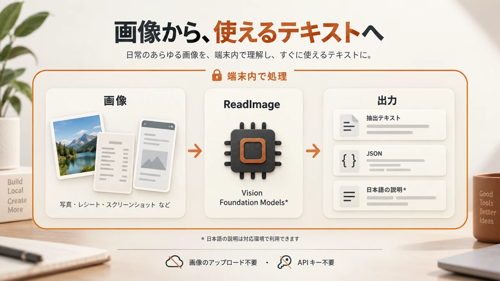

# ReadImage on Device


**画像を、端末の中で読む。**

写真・書類・スクリーンショットから、文字や画像の特徴を取り出すSwiftパッケージです。macOS用CLIの `readimage` も同梱しています。AppleのVisionとFoundation Modelsを使い、画像の解析は端末内で完結します。画像のアップロード、APIキー、外部サーバーは不要です。

- **文字と特徴を抽出** — OCR、画像分類、顔・人物・動物の検出、バーコードの読み取り。
- **テキスト・JSONで出力** — ローカル保存、検索、スクリプト、AIエージェントの前処理に。
- **対応環境では日本語の説明を生成** — Apple Intelligenceが利用できない場合も、Visionの抽出結果を返します。

ライブラリの宣言上の対応範囲は **macOS 11+ / iOS 13+**。CLIはmacOS用です。実際の最低OSはビルドに使うツールチェーンにも依存します（[対応環境](#対応環境と処理の仕組み)）。

[まず試す](#まず試すmacos-cli) · [出力を選ぶ](#出力を選ぶ) · [Swiftに組み込む](#swiftアプリに組み込む) · [LLMと連携する](#画像を読めないllmエージェントと連携する)

## まず試す：macOS CLI

GitとSwift 6.0以降のツールチェーンが必要です。Appleの開発ツール（XcodeまたはCommand Line Tools）でビルドします。

```bash
git clone https://github.com/hibachi-inc/ReadImage-on-Device.git
cd ReadImage-on-Device
swift build -c release

# 画像パスを、自分の画像に置き換えて実行
.build/release/readimage --raw /path/to/image.png
```

`--raw` はApple Intelligenceを使わずに動くため、最初の動作確認に向いています。以降の例で `readimage` として呼ぶには、ビルド後にシェルで次のエイリアスを設定してください（現在のシェルだけに適用）。

```bash
alias readimage="$PWD/.build/release/readimage"
```

```bash
readimage --raw receipt.jpg    # Visionの抽出結果
readimage --raw --json receipt.jpg  # 同じ情報をJSONで取得
readimage receipt.jpg          # 対応環境では日本語の説明を生成
```

<details>
<summary>出力のイメージを見る</summary>

次は書類画像を `--raw` で読んだ場合の説明用サンプルです。内容・分類・数値は画像と実行環境によって変わります。

```text
=== receipt.jpg  [route: vision-raw] ===
- 画像サイズ: 1800x1040
- 画像分類ラベル: document(20%), screenshot(20%)
- 写っている文字(OCR): ヒバチ株式会社請求書 / 御請求金額：128,000円 / 発行日：2026-10-01
- 平均色: #CBD5DD
```

Apple Intelligenceが使える環境では、既定の `--explain` で抽出情報を日本語の文章に整えます。説明の生成に失敗した場合は抽出結果に戻ります。

</details>

## 出力を選ぶ



| 欲しいもの | コマンド | 出力・条件 |
| --- | --- | --- |
| OCRと画像の特徴 | `readimage --raw image.png` | Visionの抽出結果。Apple Intelligence不要 |
| 加工しやすいJSON | `readimage --raw --json image.png` | 画像ごとの結果を配列で返す。Apple Intelligence不要 |
| 日本語の説明 | `readimage image.png` | 既定は `--explain`。対応環境では文章を生成し、使えなければ抽出結果を返す |

**`--raw` はOCRの文字だけではありません。** サイズ、分類、平均色なども含み、表示用のOCRは先頭40件までです。文字だけをすべて取り出すには、JSONの `recognized_texts` を使います。

```bash
# jqを利用できる環境で、OCRの文字だけを取り出す
readimage --raw --json receipt.jpg | jq -r '.[0].facts.recognized_texts[]'
```

`--json` は出力形式の指定です。単独で使うと既定の説明生成も実行するため、Visionの抽出情報だけが必要なら `--raw --json` を組み合わせます。JSON出力に生成された説明文は含まれません。

## こんな用途に

| 用途 | 使い方 |
| --- | --- |
| レシート・請求書・書類の読み取り | OCRで文字を抽出し、端末内で保存・確認する |
| 写真・スクリーンショットの整理 | 分類ラベルや読み取り文字を検索・タグ付けに使う |
| 画像を読めないLLMやエージェントの補助 | 画像をテキストに変換してから後段へ渡す |
| アプリ内の画像説明 | 日本語の説明を表示・読み上げの下地に使う |

読み取り結果や生成文には誤りが含まれることがあります。金額・日付などの重要な情報は元画像と照合してください。

## CLIの使い方

```bash
# 複数の画像をまとめて処理
readimage --raw ./scans/*.png > texts.txt
readimage --raw --json ./scans/*.png > facts.json

# 標準入力から画像を読む
cat image.png | readimage --raw -

# OCR言語や説明の依頼文を指定
readimage --raw --languages ja-JP,en-US image.png
readimage --explain --prompt "読み取れた内容を短く説明してください" image.png
```

| オプション | 説明 |
| --- | --- |
| `--raw` | AIによる文章生成をせず、Visionの抽出結果を返す |
| `--explain` | 利用可能な経路で説明を生成する（既定） |
| `--json` | 抽出情報と処理経路をJSONで出力する |
| `-p, --prompt <text>` | 説明生成の依頼文を指定する |
| `-i, --instructions <text>` | 説明生成のシステム指示を指定する |
| `--languages <a,b>` | OCR言語をカンマ区切りで指定する（既定：`ja-JP,en-US`） |
| `--no-animals` | 動物検出を省略する |
| `--no-barcodes` | バーコード・QRコードの検出を省略する |
| `-h, --help` / `--version` | ヘルプ / バージョンを表示する |

### JSONの形式と失敗の検知

1枚でも結果は配列です。成功時には `facts`、画像の読み込み失敗時には `error` が含まれます。次は形式を示す抜粋です。

```json
[
  {
    "path": "receipt.jpg",
    "route": "vision-raw",
    "mode": "raw",
    "facts": {
      "pixel_width": 1800,
      "pixel_height": 1040,
      "recognized_texts": ["御請求金額：128,000円"],
      "face_count": 0,
      "human_count": 0,
      "average_color": "#CBD5DD"
    }
  },
  {
    "path": "missing.png",
    "route": "none",
    "mode": "raw",
    "error": "画像が見つかりません: missing.png"
  }
]
```

このほか `classifications`（分類と信頼度）、`animals`、`barcodes`、`revisions`（使用したVisionのrevision）を取得できます。フィールドの詳細は [ImageFacts.swift](Sources/ReadImageOnDevice/ImageFacts.swift) と [CLIの出力定義](Sources/readimage/main.swift) を参照してください。

| 終了コード | 意味 |
| --- | --- |
| `0` | すべての画像を処理できた |
| `1` | 1枚以上の画像処理に失敗した |
| `2` | 入力がない、未知のオプション、空の標準入力など |

説明生成が使えず `vision-raw` に戻ることは、画像処理の失敗には含まれません。複数画像で一部が失敗しても、JSONにはすべての結果が出ます。パイプで終了コードを検知するには `set -o pipefail` を使ってください。

## Swiftアプリに組み込む

Swift Package Managerで追加できます。現在はバージョンタグが未公開のため、`main` ブランチを指定します。固定したい場合はコミットの `revision` を指定してください。

```swift
// Package.swift の dependencies に追加
.package(
    url: "https://github.com/hibachi-inc/ReadImage-on-Device.git",
    branch: "main"
)
```

```swift
// 利用するターゲットの dependencies に追加
.product(name: "ReadImageOnDevice", package: "ReadImage-on-Device")
```

Xcodeでは「Add Package Dependencies」から同じURLを追加し、依存条件に `main` ブランチを選べます。

### Mac：画像ファイルから

```swift
import ReadImageOnDevice

let result = try await ReadImage.read(path: "photo.jpg")
print(result.text)   // 日本語の説明、またはVisionの抽出結果
print(result.route)  // 実際に使った処理経路

// AIによる文章生成をしない
let raw = try ReadImage.rawText(at: "photo.jpg")
print(raw)

// 同期APIも利用可能
let sync = try ReadImage.readSync(path: "photo.jpg", mode: .raw)
```

### iPhone / iPad：UIImageから

```swift
import UIKit
import ReadImageOnDevice

// UIImageを受け取る非同期関数の例
func describe(_ image: UIImage) async -> String? {
    guard let cgImage = image.cgImage else { return nil }
    let result = await ReadImage.read(cgImage: cgImage, path: "photo.jpg")
    return result.text
}
```

`CGImage` を渡すAPIは `await` のみで呼べます。画像ファイルのパスを渡すAPIは読み込みエラーがあるため `try await` が必要です。どちらも `result.facts` でVisionの抽出情報を取得できます。

## 画像を読めないLLM・エージェントと連携する

画像を受け取れないモデルでも、`readimage` の出力テキストを入力として扱えます。CodexやClaude CodeなどからCLIを呼び出す前処理としても利用できます。

```bash
# まず端末内でテキスト化し、後段のツールに渡す
readimage --raw receipt.jpg > receipt-facts.txt

# JSONから文字だけを取り出す（jqが必要）
readimage --raw --json receipt.jpg | jq -r '.[0].facts.recognized_texts[]' > receipt-text.txt
```

**ReadImage自体は画像も結果も外部へ送信しません。** 出力をクラウドLLMなどに渡す場合、そのテキストは外部送信の対象になります。端末内で完結させたい場合は、保存先や後段の処理もローカルにしてください。

## 対応環境と処理の仕組み

Visionで画像の特徴を抽出し、`--explain` では環境に応じて説明の生成を試みます。

| 実行環境・条件 | 処理経路 | 説明生成の方法 |
| --- | --- | --- |
| macOS 27 / iOS 27以降 + 対応SDK・モデル | `native-multimodal(macOS27)` | 画像をFoundation Modelsへ直接入力 |
| macOS 26 / iOS 26以降 + Foundation Modelsが利用可能 | `vision+fm(macOS26)` | Visionの抽出情報をもとに文章を生成 |
| 古いOS、モデルが使えない環境、または `--raw` 指定 | `vision-raw` | Visionの抽出結果をそのまま返す |

`route` の文字列はiOSでも同じです。画像直接入力の経路はSwift 6.4以降かつ対応SDKでコンパイルされ、利用できなければVision + Foundation Models、次にVision単独へ切り替わります。Visionの各リクエストには、実行OSで利用できる最新のrevisionを選びます。精度は画像の内容や環境で変わります。

日本語の説明生成には、Apple Intelligence対応端末と利用可能なオンデバイスモデルが必要です。OSのバージョンだけでは決まりません。設定・モデルの準備状態も確認してください。

- モデルの利用可否：`ReadImage.supportsLanguageModel`
- SDKでのFoundation Modelsの取り込み：`ReadImage.hasFoundationModelsFramework`
- Appleの仕様：[Foundation Models](https://developer.apple.com/documentation/foundationmodels)

<details>
<summary>古いOS向けのビルドについて</summary>

`Package.swift` の宣言は `macOS 11 / iOS 13` ですが、ツールチェーンが対応する最低OSにも制約されます。Xcode 27でのビルドでは、最低OSがmacOS 12 / iOS 15へ引き上げられます。

macOS 11を下限とするCLIをビルドする場合は、対応するCommand Line Tools（SDK 26）を使用し、生成バイナリの `minos` を確認してください。

```bash
DEVELOPER_DIR=/Library/Developer/CommandLineTools \
  /Library/Developer/CommandLineTools/usr/bin/swift build -c release

otool -l .build/release/readimage | grep -A3 LC_BUILD_VERSION
```

iOS 13〜14を対象にする場合も、それらのデプロイ先に対応するツールチェーンが必要です。宣言値だけで実際のバイナリの下限を判断しないでください。

</details>

## 開発・テスト

```bash
swift build -c release
swift test
```

## ライセンス

[MIT License](LICENSE) — ヒバチ株式会社 / HIBACHI inc.

READMEのビジュアルはAI生成の概念図です。実際のアプリ画面ではありません。
