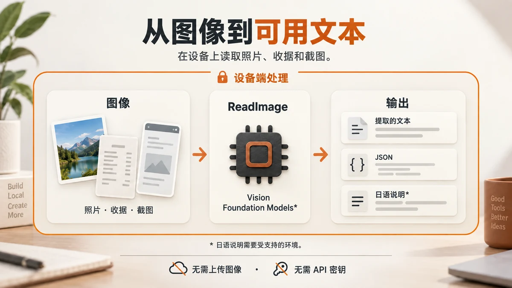

# ReadImage on Device

[English](README.md) · **简体中文** · [日本語](README.ja.md)


**在设备上，读取图像。**

这是一个从照片、文档和截图中提取文字与图像特征的Swift软件包，也包含macOS命令行工具 `readimage`。图像分析通过Apple的Vision和Foundation Models框架在设备上完成，无需上传图像、API密钥或外部服务器。

- **提取文字与图像特征** — OCR、图像分类、人脸／人物／动物检测以及条形码识别。
- **输出文本或JSON** — 用于本地保存、搜索、脚本处理和AI智能体的前处理。
- **在支持的环境中生成日语说明** — 无法使用Apple Intelligence时，仍会返回Vision提取的信息。

软件包声明的支持范围为 **macOS 11+ / iOS 13+**。CLI仅适用于macOS。实际最低系统版本还取决于构建工具链（[兼容性](#兼容性与处理流程)）。

本README为简体中文版。**CLI提示和生成的说明默认使用日语。** 文档翻译不会改变工具的输出语言。

[快速开始](#快速开始macos-cli) · [选择输出](#选择输出) · [集成到Swift](#集成到swift应用) · [连接LLM](#连接纯文本llm与智能体)

## 快速开始：macOS CLI

需要Git和Swift 6.0及以上版本的工具链。请使用Apple开发工具（Xcode或Command Line Tools）构建。

```bash
git clone https://github.com/hibachi-inc/ReadImage-on-Device.git
cd ReadImage-on-Device
swift build -c release

# 将路径替换为你自己的图像文件
.build/release/readimage --raw /path/to/image.png
```

`--raw` 不需要Apple Intelligence，适合用来确认工具是否正常运行。若要在后续示例中直接使用 `readimage`，请在构建完成后设置以下别名（仅对当前shell生效）：

```bash
alias readimage="$PWD/.build/release/readimage"
```

```bash
readimage --raw receipt.jpg         # Vision提取的信息
readimage --raw --json receipt.jpg  # 以JSON格式获取相同信息
readimage receipt.jpg               # 在支持的环境中生成日语说明
```

<details>
<summary>查看输出示例</summary>

以下为使用 `--raw` 读取文档图像的示意输出。字段标签保留了CLI实际使用的日语；内容、分类与数值会随图像和运行环境变化。

```text
=== receipt.jpg  [route: vision-raw] ===
- 画像サイズ: 1800x1040
- 画像分類ラベル: document(20%), screenshot(20%)
- 写っている文字(OCR): ヒバチ株式会社請求書 / 御請求金額：128,000円 / 発行日：2026-10-01
- 平均色: #CBD5DD
```

这四行依次表示图像尺寸、分类标签、识别出的文字与平均颜色。Apple Intelligence可用时，默认的 `--explain` 模式会将提取的信息整理为日语说明。生成失败时，会退回到提取结果。

</details>

## 选择输出



| 需要的内容 | 命令 | 输出与条件 |
| --- | --- | --- |
| OCR文字与图像特征 | `readimage --raw image.png` | Vision提取的信息，无需Apple Intelligence |
| 便于后续处理的JSON | `readimage --raw --json image.png` | 以数组返回结果，每张图像对应一项，无需Apple Intelligence |
| 日语说明 | `readimage image.png` | 默认使用 `--explain`；支持时生成说明，否则返回提取结果 |

**`--raw` 不仅包含OCR文字。** 它还包含尺寸、分类、平均颜色等信息；显示用文本中的OCR最多包含前40项。若只需要全部识别文字，请读取JSON中的 `recognized_texts`：

```bash
# 需要jq；仅输出识别出的文字
readimage --raw --json receipt.jpg | jq -r '.[0].facts.recognized_texts[]'
```

`--json` 用于指定输出格式。单独使用时，仍会执行默认的说明生成流程。如果只需要Vision提取的信息，请组合使用 `--raw --json`。JSON输出不包含生成的说明文本。

## 使用场景

| 场景 | 用法 |
| --- | --- |
| 读取收据、发票与文档 | 用OCR提取文字，在本地保存并核对 |
| 整理照片与截图 | 利用分类标签和识别文字进行搜索与标记 |
| 帮助无法读取图像的LLM与智能体 | 先将图像转换为文本，再传给后续工具 |
| 在应用中提供图像说明 | 将日语说明作为显示或朗读功能的基础 |

识别结果与生成的说明可能存在错误。金额、日期等重要信息应与原始图像核对。

## CLI用法

```bash
# 批量处理图像
readimage --raw ./scans/*.png > texts.txt
readimage --raw --json ./scans/*.png > facts.json

# 从标准输入读取图像
cat image.png | readimage --raw -

# 指定OCR语言或说明请求
readimage --raw --languages ja-JP,en-US image.png
readimage --explain --prompt "読み取れた内容を短く説明してください" image.png
```

最后一条命令用日语请求简短说明。`--languages` 控制OCR识别语言，不控制生成说明的语言。

| 选项 | 说明 |
| --- | --- |
| `--raw` | 不生成说明文本，直接返回Vision提取的信息 |
| `--explain` | 使用可用的处理流程生成说明（默认） |
| `--json` | 以JSON输出提取信息与处理路径 |
| `-p, --prompt <text>` | 指定说明生成请求 |
| `-i, --instructions <text>` | 指定说明生成的系统指令 |
| `--languages <a,b>` | 用逗号分隔OCR语言（默认：`ja-JP,en-US`） |
| `--no-animals` | 跳过动物检测 |
| `--no-barcodes` | 跳过条形码与二维码检测 |
| `-h, --help` / `--version` | 显示帮助／版本 |

### JSON格式与失败处理

即使只处理一张图像，结果也以数组返回。成功时包含 `facts`，图像加载失败时包含 `error`。以下为结构示例的节选，OCR内容和错误消息保留原始语言。

```json
[
  {
    "path": "receipt.jpg",
    "route": "vision-raw",
    "mode": "raw",
    "facts": {
      "pixel_width": 1800,
      "pixel_height": 1040,
      "recognized_texts": ["御請求金額：128,000円"],
      "face_count": 0,
      "human_count": 0,
      "average_color": "#CBD5DD"
    }
  },
  {
    "path": "missing.png",
    "route": "none",
    "mode": "raw",
    "error": "画像が見つかりません: missing.png"
  }
]
```

还可获取 `classifications`（分类与置信度）、`animals`、`barcodes`、`revisions`（使用的Vision revision）。字段详情见 [ImageFacts.swift](Sources/ReadImageOnDevice/ImageFacts.swift) 和 [CLI输出定义](Sources/readimage/main.swift)。

| 退出码 | 含义 |
| --- | --- |
| `0` | 所有图像均处理成功 |
| `1` | 至少一张图像处理失败 |
| `2` | 未提供输入、未知选项、标准输入为空等 |

说明生成不可用而退回 `vision-raw` 不算图像处理失败。批量处理中，即使部分图像失败，JSON仍会包含全部结果。要在管道中检测失败，请使用 `set -o pipefail`。

## 集成到Swift应用

可通过Swift Package Manager添加。目前尚未发布版本标签，因此请指定 `main` 分支。若要固定到某个提交，可改用 `revision`。

```swift
// 添加到Package.swift的dependencies中
.package(
    url: "https://github.com/hibachi-inc/ReadImage-on-Device.git",
    branch: "main"
)
```

```swift
// 添加到使用该软件包的target的dependencies中
.product(name: "ReadImageOnDevice", package: "ReadImage-on-Device")
```

在Xcode中，可通过“Add Package Dependencies”输入同一URL，并将依赖条件设置为 `main` 分支。

### Mac：读取图像文件

```swift
import ReadImageOnDevice

let result = try await ReadImage.read(path: "photo.jpg")
print(result.text)   // 日语说明，或Vision提取的信息
print(result.route)  // 实际使用的处理路径

// 不生成说明文本
let raw = try ReadImage.rawText(at: "photo.jpg")
print(raw)

// 也可使用同步API
let sync = try ReadImage.readSync(path: "photo.jpg", mode: .raw)
```

### iPhone / iPad：读取UIImage

```swift
import UIKit
import ReadImageOnDevice

// 接收UIImage的异步函数示例
func describe(_ image: UIImage) async -> String? {
    guard let cgImage = image.cgImage else { return nil }
    let result = await ReadImage.read(cgImage: cgImage, path: "photo.jpg")
    return result.text
}
```

传入 `CGImage` 的API只需要 `await`。传入文件路径的API可能发生加载错误，因此需要 `try await`。两种方式都可通过 `result.facts` 获取Vision提取的信息。

## 连接纯文本LLM与智能体

无法接收图像的模型也可以将 `readimage` 输出的文本作为输入。Codex、Claude Code等智能体也可调用CLI，将其作为图像前处理工具。

```bash
# 先在本地转为文本，再交给后续工具
readimage --raw receipt.jpg > receipt-facts.txt

# 从JSON中提取OCR文字（需要jq）
readimage --raw --json receipt.jpg | jq -r '.[0].facts.recognized_texts[]' > receipt-text.txt
```

**ReadImage本身不会向外部服务发送图像或处理结果。** 如果把输出交给云端LLM，该文本就会被发送到外部。若要让整个流程都在设备上完成，保存位置与后续处理也应保持在本地。

## 兼容性与处理流程

Vision负责提取图像特征。使用 `--explain` 时，工具会根据可用环境尝试生成说明。

| 运行环境与条件 | 处理路径 | 说明生成方式 |
| --- | --- | --- |
| macOS 27 / iOS 27及以上，且SDK与模型支持 | `native-multimodal(macOS27)` | 直接将图像输入Foundation Models |
| macOS 26 / iOS 26及以上，且Foundation Models可用 | `vision+fm(macOS26)` | 根据Vision提取的信息生成说明 |
| 较旧系统、模型不可用或指定了 `--raw` | `vision-raw` | 直接返回Vision提取的信息 |

iOS使用相同的 `route` 字符串。图像直接输入路径需使用Swift 6.4及以上版本和兼容SDK编译。无法使用时，先退回Vision + Foundation Models，再退回仅使用Vision的流程。每个Vision请求会选择运行系统支持的最新revision。准确性取决于图像内容与运行环境。

生成日语说明需要支持Apple Intelligence的设备和可用的设备端模型。仅满足系统版本要求还不够，也需要确认设置与模型准备状态。

- 模型是否可用：`ReadImage.supportsLanguageModel`
- SDK是否包含Foundation Models框架：`ReadImage.hasFoundationModelsFramework`
- Apple文档：[Foundation Models](https://developer.apple.com/documentation/foundationmodels)

<details>
<summary>面向较旧系统构建</summary>

`Package.swift` 声明的最低版本为 `macOS 11 / iOS 13`，但仍受工具链支持的部署目标限制。使用Xcode 27构建时，最低版本会提高到macOS 12 / iOS 15。

若要构建以macOS 11为最低版本的CLI，请使用兼容的Command Line Tools（SDK 26），并检查生成二进制文件的 `minos`：

```bash
DEVELOPER_DIR=/Library/Developer/CommandLineTools \
  /Library/Developer/CommandLineTools/usr/bin/swift build -c release

otool -l .build/release/readimage | grep -A3 LC_BUILD_VERSION
```

以iOS 13〜14为目标时，同样需要支持这些部署目标的工具链。不要仅凭软件包中的声明判断实际二进制文件的最低系统版本。

</details>

## 开发与测试

```bash
swift build -c release
swift test
```

## 许可证

[MIT License](LICENSE) — HIBACHI inc.

README中的视觉素材为AI生成的概念图，并非实际应用截图。
